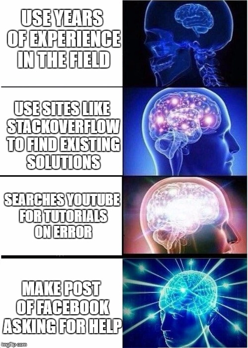

# compsci-faq
Welcome to the computer science faq, the place to hopefully answer *all* of your questions.

## Table of Contents

### Comp 51
    - [Arrays](51/Arrays.md)

# My code is broken! What do I do?

Computer science is hard and often things break and you have no idea why. Luckily, you are not alone in this and you have an entire internet of resources at your disposal!

### Resources:
1. [Stack Overflow](https://stackoverflow.com/) a site with answered questions about programming.
